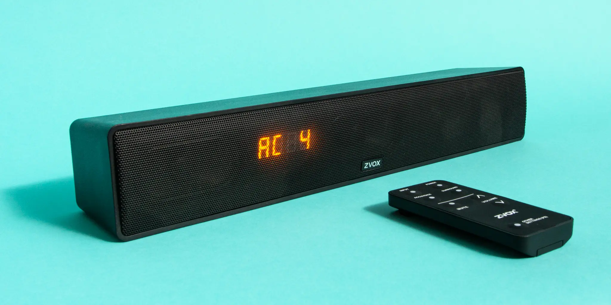

# Product Reviews and Buying Advice

## New York Times Wirecutter

>Wirecutter tests and reviews the best tech, appliances, gear, and more. You can trust our veteran journalists, scientists, and experts to find the best stuff for your home and life. We spend hours researching and testing products, and we only recommend the best.

Wirecutter is very good about researching products for the elderly. An easy way to search for the products Wirecutter recommends is by clicking on this link.

* https://www.nytimes.com/wirecutter/search/?s=elderly

### Wirecutter: The Best Laptops for Older Adults

* https://www.nytimes.com/wirecutter/reviews/best-laptops-for-seniors/

### Wirecutter: Trouble Hearing TV Dialogue? The Right Soundbar Can Help

* https://www.nytimes.com/wirecutter/reviews/soundbar-can-help-hear-dialogue/

### Wirecutter: The Best Over-the-Counter Hearing Aids

* https://www.nytimes.com/wirecutter/reviews/best-over-the-counter-hearing-aids/

## National Council on Aging (NCOA)

>Improving the lives of older adults, especially those who are struggling, is not just your job–it’s at your core. Gain your inspiration here and find NCOA tools, tips, and resources to help improve your delivery and service.

>https://www.ncoa.org/product-resources/
https://www.ncoa.org/product-resources/

## Tech Enhanced Life
>Tech Enhanced Life is a resource for older adults, caregivers, and professionals to discover and learn about technology that can enhance the lives of older adults. We provide reviews, guides, and resources to help you find the right technology for your needs.

* https://www.techenhancedlife.com/recommendations-reviews-aging